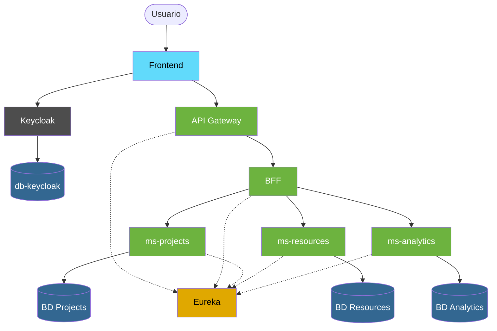
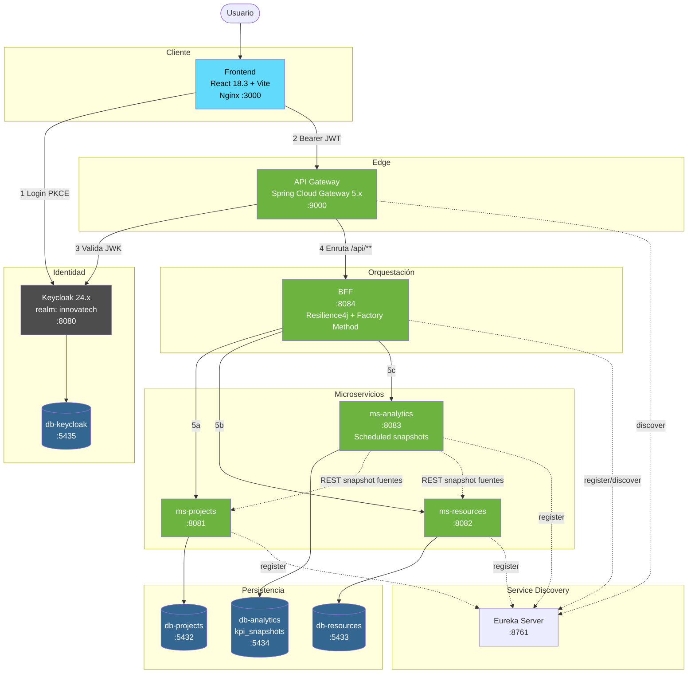
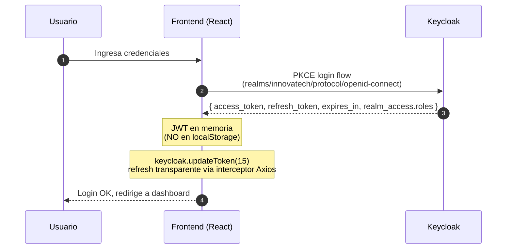
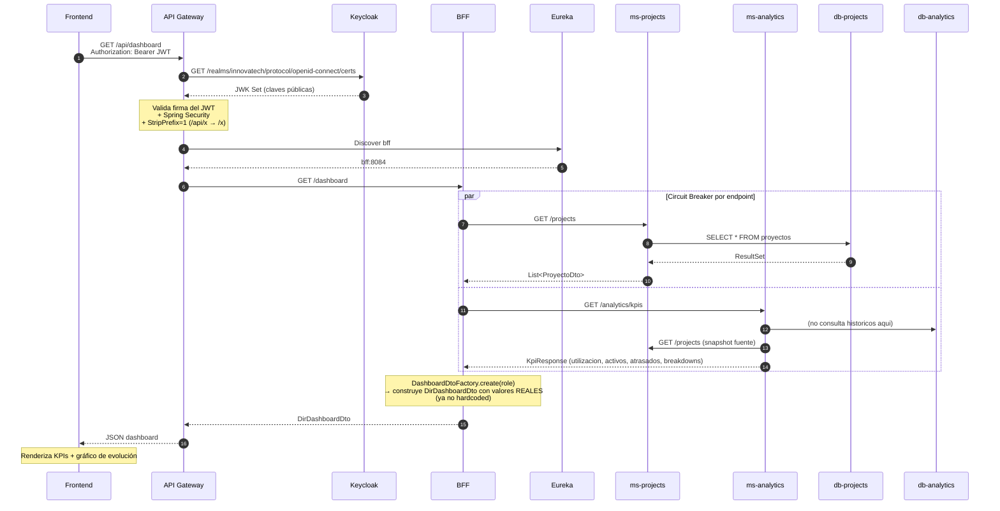
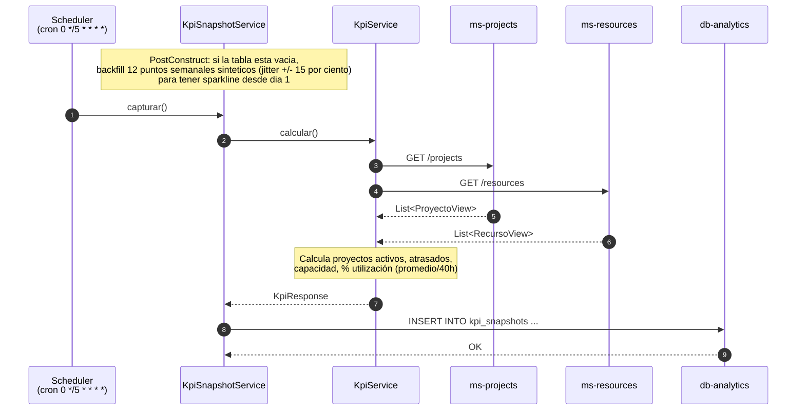
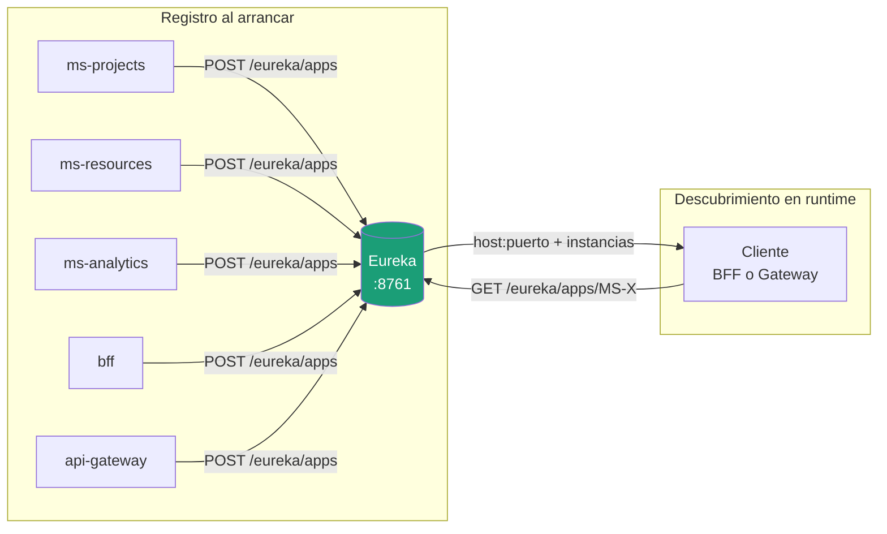
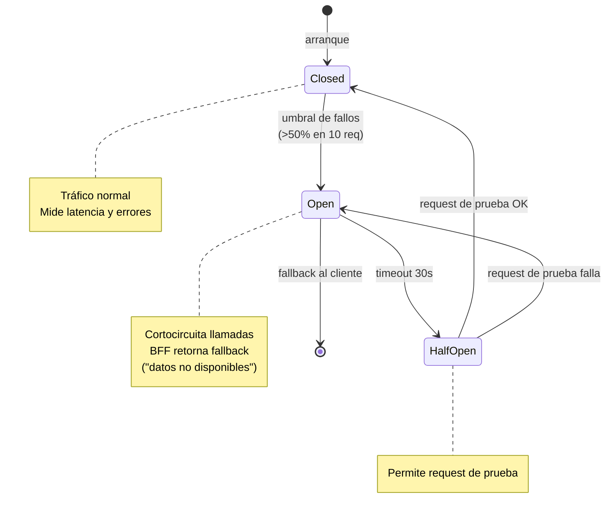
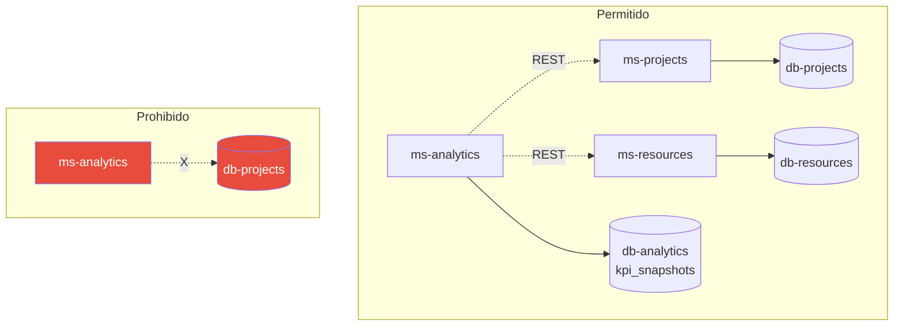

# InnovaTech Solutions

Plataforma de gestión de proyectos basada en arquitectura de microservicios con autenticación centralizada, service discovery, circuit breakers, persistencia histórica de KPIs y un frontend dark estilo *Linear/Vercel* totalmente integrado al stack.

## Contexto del Negocio

**InnovaTech Solutions** es una empresa de desarrollo de software a medida y
consultoría tecnológica con más de 120 empleados. Sus equipos son
multidisciplinarios (backend, frontend, DevOps, UX, gestores de proyecto) y
están distribuidos en distintas ubicaciones geográficas.

**Problema que resuelve la plataforma:**
- No hay visibilidad en tiempo real del estado de los proyectos.
- La asignación de recursos humanos se hace de forma manual y poco eficiente.
- Los directivos no cuentan con indicadores centralizados para tomar
  decisiones con datos concretos.

## Stack Tecnológico

| Capa | Tecnología | Versión |
|------|------------|---------|
| Runtime backend | Java LTS | **25** |
| Framework backend | Spring Boot | **4.0.x** |
| Release train | Spring Cloud | **2025.1.0 "Oakwood"** |
| Persistencia | Spring Data JPA + Hibernate | 7.x |
| Migraciones | Flyway | 11.x |
| Pool de conexiones | HikariCP | default Boot |
| Autenticación | Keycloak (OAuth2/OIDC, realm `innovatech`) | 24.x |
| API Gateway | Spring Cloud Gateway Server WebFlux | starter 5.0.x |
| Service Discovery | Netflix Eureka | starter 5.0.x |
| Circuit Breaker | Resilience4j | 2.2 |
| Base de datos | PostgreSQL | **16** |
| Frontend | React + Vite + TypeScript | 18.3 / 5.x |
| UI styling | Tailwind CSS + Recharts + Lucide | 3.4 / 2.13 |
| Autenticación FE | keycloak-js (PKCE) | 24.x |
| HTTP FE | Axios con interceptor de refresh | 1.x |
| Build & runtime FE | Vite (build) → Nginx Alpine (serve) | — |
| Build tool | Maven multi-module | 3.9+ |
| Contenedores | Docker + Docker Compose | — |

## Componentes y Puertos

| Servicio | Host interno | Puerto host | URL local |
|----------|--------------|-------------|-----------|
| Frontend (Nginx) | frontend | 3000 → 80 | http://localhost:3000 |
| Keycloak | keycloak | 8080 | http://localhost:8080 |
| API Gateway | api-gateway | 9000 | http://localhost:9000 |
| BFF | bff | 8084 | — |
| ms-projects | ms-projects | 8081 | — |
| ms-resources | ms-resources | 8082 | — |
| ms-analytics | ms-analytics | 8083 | — |
| Eureka Server | eureka-server | 8761 | http://localhost:8761 |
| DB Projects | db-projects | 5432 | — |
| DB Resources | db-resources | 5433 | — |
| DB Analytics | db-analytics | 5434 | — |
| DB Keycloak | db-keycloak | 5435 | — |

Toda la comunicación interna ocurre sobre la red Docker `innovatech-net`.

> **Pendientes de orquestación** (placeholders comentados en `docker-compose.yml`): MailHog (notificaciones SMTP dev), Prometheus 2.51 y Grafana 10.4 para observabilidad. Los servicios Spring ya exponen `/actuator/prometheus`, falta solo descomentar el bloque y proveer la config.

## Arquitectura de Alto Nivel



## Arquitectura General



## Dominio de cada Microservicio

| Microservicio | Responsabilidad funcional |
|---|---|
| **ms-projects** | Core operativo. CRUD de proyectos: `GET /projects`, `GET /projects/{id}`, `POST /projects`, `PATCH /projects/{id}` (estado/responsable) y `DELETE /projects/{id}`. Migraciones Flyway. |
| **ms-resources** | Gestión del talento. CRUD: `GET`, `GET /{id}`, `POST`, `PATCH /{id}` (cambia flag `active`), `DELETE /{id}`. Validación de email único. |
| **ms-analytics** | Agregador de KPIs cross-org **con persistencia de snapshots históricos** (antes era stateless, decisión revisada el 2026-05-16). Consume `ms-projects`/`ms-resources` vía REST + Eureka, nunca conecta directo a sus BDs. Expone `/analytics/kpis` (snapshot actual) y `/analytics/kpis/history?from&to&points` (serie temporal con tope de 30 días). |

## Frontend

Aplicación React + Vite + TypeScript, **dark theme** inspirado en Linear/Vercel/Supabase. Build estático servido por Nginx en contenedor.

| Vista | Estado | Detalle |
|-------|--------|---------|
| **Login** | ✅ Implementado | Keycloak PKCE flow vía `keycloak-js`. Token en memoria, refresh transparente vía interceptor Axios. |
| **Dashboard** | ✅ Implementado | KPIs derivados de fuentes reales (sin hardcoded). Vista distinta por rol (PM, DEV, DIR) con Factory Method en BFF. Para DIR: KPI cards con sparkline, donut de recursos por rol, panel de capacidad, barra apilada de proyectos por estado, **selector de fechas (rango ≤ 30 días) + gráfico de evolución** con utilización vs proyectos activos. |
| **Proyectos** | ✅ Implementado | Tabla densa con búsqueda, filtros por estado, badges semánticos. Crear (modal), editar estado/responsable (modal, solo DIR), selección múltiple + borrado en lote (solo DIR). |
| **Recursos** | ✅ Implementado | Tabla densa con avatares + iniciales, filtros por rol y "solo activos". Badges con paleta por rol (DEV/QA/DEVOPS/DESIGNER/PM). Crear, marcar inactivo (solo DIR), borrado en lote (solo DIR). |
| **Analítica** | 🚧 Oculta | Vista dedicada para perfil directivo. Pendiente próxima iteración. El backend (snapshots + endpoint histórico) ya está disponible. |

**Componentes reutilizables** en `frontend/src/components/`: `Card`, `Badge`, `Button`, `Checkbox` (con indeterminate), `Dropdown`, `Modal` + helpers (`Field`, `TextInput`, `SelectInput`, `TextArea`, `ConfirmDialog`), `Sidebar`, `Topbar`, `Layout`.

**Tema** vía CSS variables en `index.css` (paleta `bg`/`surface`/`fg`/`accent`/`success`/`warning`/`danger` + colores específicos por rol funcional) consumidas desde Tailwind con `rgb(var(--x) / <alpha-value>)` para soportar opacidades semánticas.

**Branding**: logo en `frontend/public/logoLuffy.png` + tipografía corporativa **Space Grotesk** (Google Fonts) en el sidebar.

## Flujo de Autenticación

El Frontend obtiene un JWT directamente desde Keycloak antes de cualquier llamada al backend.



## Flujo End-to-End de un Request

Caso: usuario DIR solicita su dashboard. El BFF orquesta llamadas a `ms-projects` (lista para hitos/en-curso) y a `ms-analytics` (KPIs agregados).



## Snapshots Históricos de KPI (decisión 2026-05-16)

`ms-analytics` toma snapshots periódicos de los KPIs agregados y los persiste en `db-analytics` (tabla `kpi_snapshots`). Permite series temporales para sparklines, deltas vs períodos anteriores y filtros por rango de fechas.



**Endpoint `GET /api/kpis/history`**:

| Query param | Descripción | Default |
|-------------|-------------|---------|
| `puntos` | Últimos N snapshots | 12 |
| `desde` | ISO date `YYYY-MM-DD` | — |
| `hasta` | ISO date `YYYY-MM-DD` | — |

Si `desde` + `hasta` están presentes, devuelve los snapshots en ese rango. Si el rango supera **30 días**, responde `400 Bad Request`. La respuesta incluye `deltas` vs ~30 días atrás (utilización, proyectos activos, recursos activos).

## Service Discovery (Eureka)

Todos los componentes server-side se registran en Eureka al arrancar, y consultan Eureka antes de invocar a otro servicio.



## Manejo de Fallos: Circuit Breaker (Resilience4j)

Cada llamada saliente del BFF está envuelta en un Circuit Breaker independiente (uno por endpoint downstream). Si `ms-analytics` no responde en 3s, el breaker se abre y el BFF devuelve un fallback **explícito** (`"datos no disponibles"`) sin afectar a los otros servicios.



> **Regla ética del fallback**: cuando un breaker está OPEN, el BFF responde `"datos no disponibles"` antes que datos potencialmente desactualizados. La empresa toma decisiones sobre personas con estos datos; mostrar información incorrecta es peor que mostrar nada.

## Aislamiento de Datos

Cada microservicio accede **únicamente** a su propia BD. `ms-analytics` consume datos de proyectos/resources por REST (vía Eureka), nunca conectándose directo a sus BDs. Su BD propia solo aloja **snapshots agregados**.



## Patrones de Diseño Aplicados

| Patrón | Dónde | Notas |
|--------|-------|-------|
| **API Gateway** | `api-gateway/` | Entrada única, valida JWT contra JWK de Keycloak, aplica `StripPrefix=1` para que `ms-*` no conozcan el prefijo `/api`. |
| **Backend-for-Frontend (BFF)** | `bff/` | Agrega y adapta por rol. Sin BD propia. |
| **Factory Method** | `bff/service/DashboardDtoFactory.java` | Construye `PMDashboardDto`/`DevDashboardDto`/`DirDashboardDto` según rol del JWT (sealed interface). |
| **Circuit Breaker** | `bff/` (Resilience4j) | Uno por endpoint downstream. Timeout 3s, ventana de 10 req, 30s en OPEN. |
| **Service Discovery** | Todos los Spring Boot | Eureka client + server. Sin URLs hardcodeadas. |
| **Repository Pattern** | Cada `ms-*` y `ms-analytics` | Spring Data JPA, interfaces `*Repository`. |
| **Database per Service** | Cada `ms-*` | PostgreSQL independiente. |
| **Snapshot / Periodic Aggregation** | `ms-analytics` | `@Scheduled` toma snapshots cada N min para series temporales (sparkline, deltas). |

## Cómo Levantar el Entorno Local

Un solo comando levanta el stack completo (DBs, Keycloak con realm pre-cargado, Eureka, servicios, BFF, Gateway y frontend).

```bash
# 1. Clonar el repo
git clone <repo-url>
cd innovatech-solutions

# 2. (Opcional) copiar variables
cp .env.example .env   # ajustar passwords si quieres

# 3. Levantar TODO
docker compose up -d --build

# 4. Acceder al frontend
open http://localhost:3000

# 5. Ver servicios registrados en Eureka
open http://localhost:8761
```

**Sub-comandos útiles:**

```bash
docker compose ps                       # estado de los contenedores
docker compose logs -f bff              # logs en vivo
docker compose up -d --no-deps --build ms-analytics  # rebuild de un servicio
docker compose down                     # bajar (preserva volúmenes/datos)
docker compose down -v                  # bajar BORRANDO datos de las BDs
```

## URLs de Referencia

| Servicio | URL |
|----------|-----|
| Frontend | http://localhost:3000 |
| Keycloak Admin | http://localhost:8080 |
| Eureka Dashboard | http://localhost:8761 |
| API Gateway | http://localhost:9000 |
| Actuator (cualquier service Spring) | `http://localhost:<puerto>/actuator/health` |

## Convenciones del Proyecto

**Naming:**
- Módulos Maven: kebab-case (`ms-projects`, `api-gateway`).
- `groupId`: `cl.duoc.innovatech`. Paquetes: `cl.duoc.innovatech.<modulo>`.
- Imágenes Docker: `innovatech/<servicio>:dev`.
- Tablas SQL: `snake_case` plural.
- Endpoints REST: kebab-case plural (`/projects`, `/resources`, `/kpis/history`).

**Git:**
- Ramas: `PROD` (estable) ← `main` (deployable) ← `dev` (trabajo activo) ← `feature/*`, `fix/*`.
- Commits en español, una línea, formato: `<Prefijo> <componentes>` sin dos puntos. Prefijos: `Se agrega`, `Se corrige`, `Refactorización`, `Nueva tarea`, `Documentación`, `Estilo`, `Pruebas`.

## Roles y Permisos

| Rol Keycloak | Vista | Crear | Editar | Borrar (individual + bulk) |
|--------------|-------|-------|--------|---------------------------|
| **PM** | Dashboard PM con cartera + hitos próximos | — | — | — |
| **DEV** | Dashboard DEV con proyectos en curso | — | — | — |
| **DIR** | Dashboard ejecutivo + Proyectos + Recursos + filtros de fecha | ✅ | ✅ (estado/responsable en proyectos; activo→inactivo en recursos) | ✅ |

## Consideraciones Éticas y de Cumplimiento

El diseño sigue los principios de **Ethically Aligned Design (IEEE)**, dado que InnovaTech maneja datos personales de más de 120 personas.

| Principio | Implementación en la plataforma |
|---|---|
| **Protección de datos y privacidad** | Control de acceso por roles vía Keycloak. JWT validado en cada request. Minimización: cada microservicio solo accede a los datos que necesita. `ms-analytics` trabaja con métricas agregadas (counts, ratios), no con datos individuales. |
| **Transparencia y trazabilidad** | Logs estructurados en cada servicio. Endpoints Actuator expuestos para auditoría. Snapshots históricos permiten reconstruir el estado pasado de los KPIs. |
| **Resiliencia ética** | Cuando un servicio cae, el Circuit Breaker hace que el BFF retorne `"datos no disponibles"` antes que devolver datos erróneos. |
| **Accesibilidad** | Frontend con foco-visible, `aria-label` en botones de acciones, contraste WCAG AA en la paleta dark (verificado para `fg`/`fg-muted` sobre `bg`). |

---

## Referencias: Repositorios Similares en GitHub

Selección curada de proyectos open source con stack o patrones equivalentes (Spring Boot + microservicios + Eureka + Gateway + Keycloak + Resilience4j + Docker Compose). Útiles como benchmark o para comparar decisiones.

### Stack altísimamente equivalente

- **[arivan-amin/Cinemayan-Spring-Microservices](https://github.com/arivan-amin/Cinemayan-Spring-Microservices)** — ⭐ El más cercano: **Java 25 + Spring Boot 4**, Eureka, Keycloak, Prometheus/Grafana/Loki/Tempo, Clean Architecture + DDD.
- **[Nasruddin/spring-boot-based-microservices](https://github.com/Nasruddin/spring-boot-based-microservices)** — Spring Cloud Gateway + Keycloak (OAuth2/OIDC) + observabilidad completa (OTel + Grafana + Loki + Tempo + Prometheus), MongoDB + PostgreSQL, Docker Compose y Kubernetes.
- **[miliariadnane/demo-microservices](https://github.com/miliariadnane/demo-microservices)** — E-commerce con Eureka + **Resilience4j Circuit Breaker** + Keycloak/OAuth2 + Feign + RabbitMQ + Prometheus/Grafana + Zipkin/Sleuth + PostgreSQL.
- **[subhashlamba/spring-boot-microservice-example](https://github.com/subhashlamba/spring-boot-microservice-example)** — Eureka Server/Client + Spring Cloud API Gateway + OAuth2 + **Resilience4j** + Feign + Zipkin. Excelente para comparar el wiring básico.

### Mismo patrón general (microservicios + Gateway + Eureka + Keycloak)

- **[SaiUpadhyayula/spring-boot-3-microservices-course](https://github.com/SaiUpadhyayula/spring-boot-3-microservices-course)** — Spring Boot 3, Angular, Keycloak (OAuth2), Kafka, Schema Registry, Kubernetes, Grafana/Loki/Tempo.
- **[Rapter1990/SpringBootMicroservices](https://github.com/Rapter1990/SpringBootMicroservices)** — Eureka + Config Server + API Gateway + Keycloak + RabbitMQ + Docker Compose.
- **[kartik1502/Spring-Boot-Microservices-Banking-Application](https://github.com/kartik1502/Spring-Boot-Microservices-Banking-Application)** — Aplicación bancaria con Service Registry + API Gateway + Feign + Keycloak + Spring Data JPA + MySQL.
- **[andresrodriguez55/rent-a-car-microservices](https://github.com/andresrodriguez55/rent-a-car-microservices)** — Eureka + Keycloak + Kafka + OpenFeign + Grafana/Prometheus/Zipkin + Clean Architecture.

### Casos de referencia (libros / series)

- **[hdimitrieski/e-shop](https://github.com/hdimitrieski/e-shop)** — Spring Cloud + Keycloak + CQRS/Event Sourcing (Axon) + Kafka + GraphQL + Zipkin. Más ambicioso, útil para ver event-driven sobre la misma base.
- **[PacktPublishing/Microservices-with-Spring-Boot-and-Spring-Cloud-Third-Edition](https://github.com/PacktPublishing/Microservices-with-Spring-Boot-and-Spring-Cloud-Third-Edition)** — Código del libro de Magnus Larsson (3ra ed.). Referencia canónica.
- **[sivaprasadreddy/spring-boot-microservices-series](https://github.com/sivaprasadreddy/spring-boot-microservices-series)** — Serie de artículos con código asociado.
- **[anilallewar/microservices-basics-spring-boot](https://github.com/anilallewar/microservices-basics-spring-boot)** — Framework educativo clásico para crear microservicios con Spring Boot + Spring Cloud.

### Listas y meta-referencias

- **[mfornos/awesome-microservices](https://github.com/mfornos/awesome-microservices)** — Lista curada de principios, frameworks y herramientas de arquitectura de microservicios (14K ⭐).
- **[rohitghatol/spring-boot-microservices](https://github.com/rohitghatol/spring-boot-microservices)** — Template pionero (Zuul/Eureka/Hystrix) — desactualizado pero útil para entender la evolución del stack.

---

_Documentación actualizada el 2026-05-16. Refleja el estado tras incorporar persistencia histórica en `ms-analytics`, frontend completo (Dashboard real, Proyectos y Recursos con CRUD parcial), filtro de fechas en Dashboard y branding (logo + tipografía corporativa). La vista **Analítica** queda planificada para la siguiente iteración._
