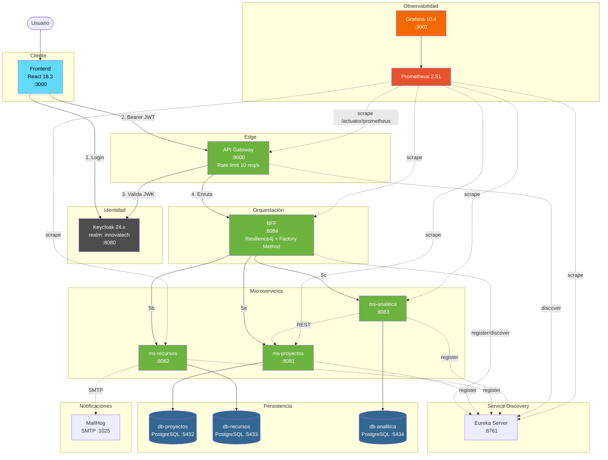
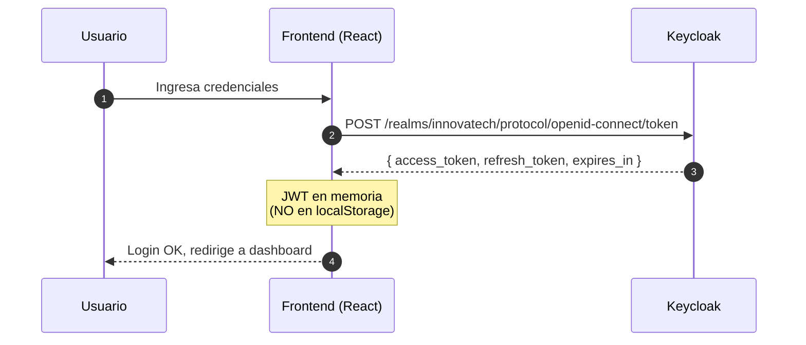
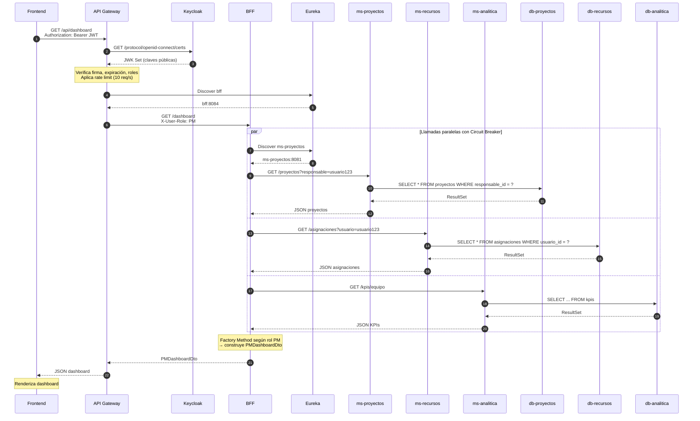
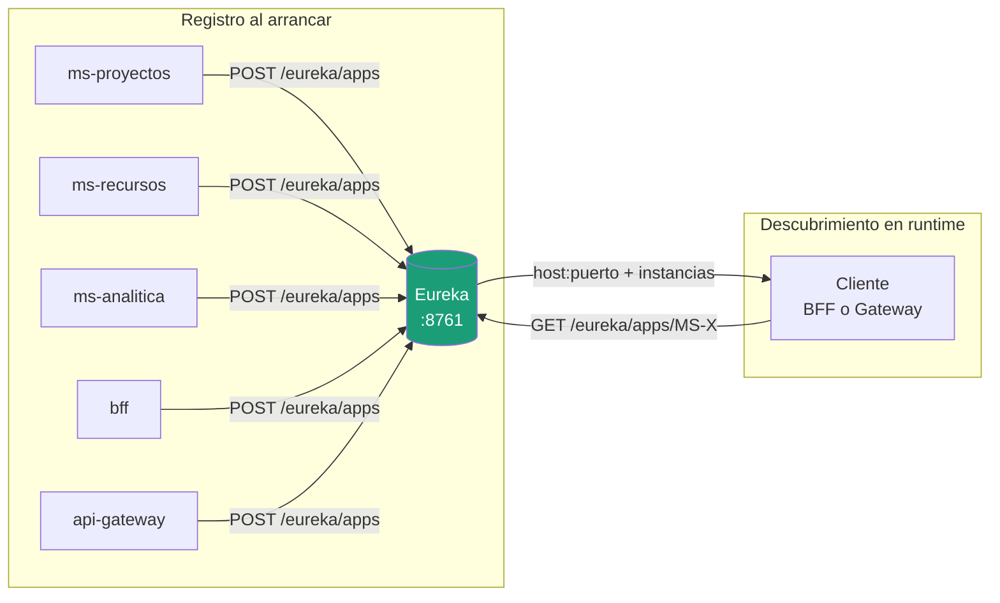
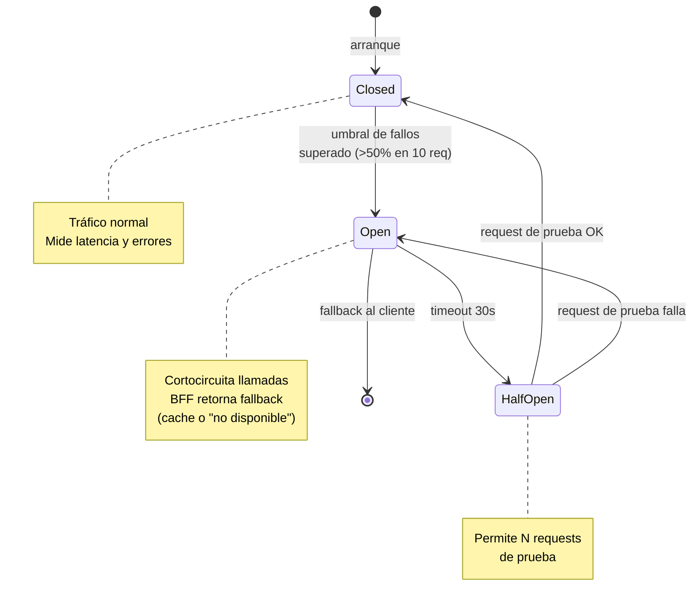
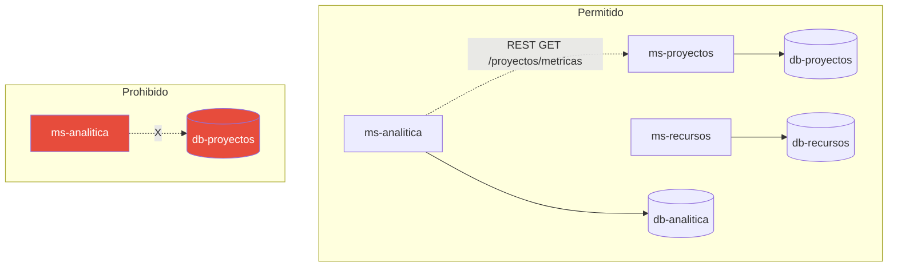
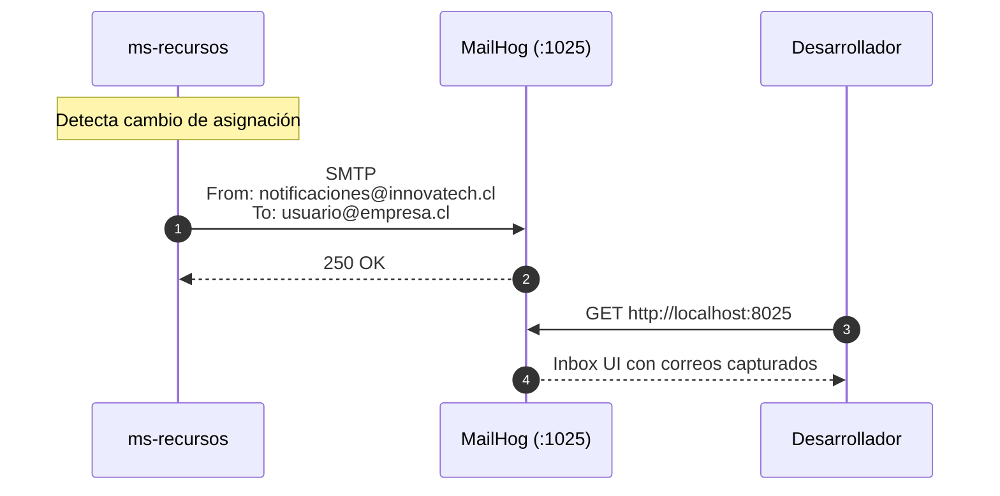
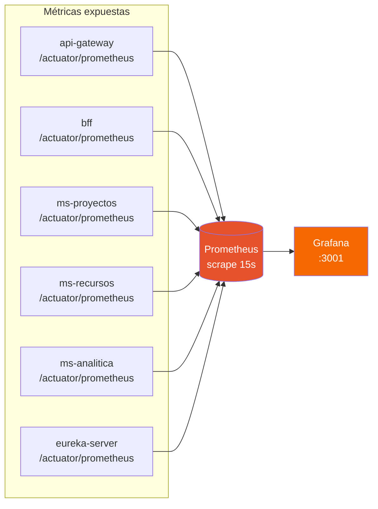

# Innovatech Solutions

Plataforma de gestión de proyectos basada en arquitectura de microservicios con autenticación centralizada, service discovery, circuit breakers y observabilidad end-to-end.

## Contexto del Negocio

**Innovatech Solutions** es una empresa de desarrollo de software a medida y
consultoría tecnológica con más de 120 empleados. Sus equipos son
multidisciplinarios (backend, frontend, DevOps, UX, gestores de proyecto) y
están distribuidos en distintas ubicaciones geográficas.

**Problema que resuelve la plataforma:**
- No hay visibilidad en tiempo real del estado de los proyectos.
- La asignación de recursos humanos se hace de forma manual y poco eficiente.
- Los directivos no cuentan con indicadores centralizados para tomar
  decisiones con datos concretos.

## Stack Tecnológico

| Capa | Tecnología |
|------|------------|
| Frontend | React 18.3 |
| Autenticación | Keycloak 24.x (OAuth2 / OpenID Connect) |
| API Gateway | Spring Cloud Gateway |
| BFF | Spring Boot |
| Microservicios | Spring Boot + Spring Data JPA + Hibernate 6.4 |
| Service Discovery | Netflix Eureka |
| Circuit Breaker | Resilience4j 2.2 |
| Base de datos | PostgreSQL |
| Pool de conexiones | HikariCP |
| Mensajería SMTP (dev) | MailHog |
| Observabilidad | Prometheus 2.51 + Grafana 10.4 |
| Contenedores | Docker + Docker Compose |

## Componentes y Puertos

| Servicio | Host interno | Puerto | URL local |
|----------|--------------|--------|-----------|
| Frontend | - | 3000 | http://localhost:3000 |
| Keycloak | keycloak | 8080 | http://localhost:8080 |
| API Gateway | api-gateway | 9000 | http://localhost:9000 |
| BFF | bff | 8084 | - |
| ms-proyectos | ms-proyectos | 8081 | - |
| ms-recursos | ms-recursos | 8082 | - |
| ms-analitica | ms-analitica | 8083 | - |
| Eureka Server | eureka-server | 8761 | http://localhost:8761 |
| DB Proyectos | db-proyectos | 5432 | - |
| DB Recursos | db-recursos | 5433 | - |
| DB Analítica | db-analitica | 5434 | - |
| MailHog (SMTP) | mailhog | 1025 | - |
| MailHog (UI) | mailhog | 8025 | http://localhost:8025 |
| Prometheus | prometheus | 9090 | http://localhost:9090 |
| Grafana | grafana | 3001 | http://localhost:3001 |

Toda la comunicación interna ocurre sobre la red Docker `innovatech-net`.

## Arquitectura General



> Diagramas C4 detallados (System Context, Container y sub-diagramas por
> patrón) disponibles en [`docs/diagramas/`](docs/diagramas/) (formato
> drawio XML) y [`docs/imagenes/`](docs/imagenes/) (PNG renderizado).

## Dominio de cada Microservicio

| Microservicio | Responsabilidad funcional |
|---|---|
| **ms-proyectos** | Core operativo. Ciclo de vida completo de proyectos: creación, tareas, asignación de responsables, estados y avance. Es el servicio con mayor crecimiento proyectado a medida que se sumen clientes. |
| **ms-recursos** | Gestión de disponibilidad (capacity) del recurso humano, asignaciones a proyectos y visibilidad entre equipos. Dispara notificaciones SMTP cuando hay cambios de asignación. |
| **ms-analitica** | Dashboards con KPIs para perfil **directivo**. Consume datos de los otros dos servicios vía REST interna; nunca duplica información. |

## Flujo de Autenticación

El Frontend obtiene un JWT directamente desde Keycloak antes de cualquier llamada al backend.



## Flujo End-to-End de un Request

Caso: usuario PM solicita su dashboard. El BFF orquesta 3 llamadas paralelas con Circuit Breaker.



## Service Discovery (Eureka)

Todos los componentes server-side se registran en Eureka al arrancar, y consultan Eureka antes de invocar a otro servicio. Esto permite escalado horizontal transparente.



## Manejo de Fallos: Circuit Breaker (Resilience4j)

Cada llamada del BFF a un microservicio está envuelta en un Circuit Breaker independiente. Si `ms-analitica` no responde en 3s, el breaker se abre y el BFF devuelve un fallback sin afectar a los otros dos servicios.



## Aislamiento de Datos

Cada microservicio accede **únicamente** a su propia base de datos. Si `ms-analitica` necesita datos de proyectos, lo hace vía REST al `ms-proyectos`, nunca conectándose directo a `db-proyectos`.



## Notificaciones por Correo

`ms-recursos` envía notificaciones SMTP cuando ocurre un cambio de asignación. En desarrollo todo va a MailHog.



> En producción, el host SMTP se reemplaza por Gmail u otro proveedor mediante variables de entorno.

## Observabilidad

Prometheus hace scrape cada 15 segundos a los endpoints `/actuator/prometheus` de todos los servicios. Grafana lee de Prometheus y expone dashboards en `http://localhost:3001`.



Métricas relevantes recolectadas:

- `jvm_memory_used_bytes` — RAM por servicio
- `process_cpu_usage` — CPU
- `http_server_requests_seconds` — latencia y conteo HTTP
- `resilience4j_circuitbreaker_state` — estado de cada breaker (closed/open/half-open)
- `resilience4j_circuitbreaker_calls` — calls exitosos y fallidos
- `hikaricp_connections_active` — conexiones activas al pool de BD

## Cómo Levantar el Entorno Local

```bash
# 1. Clonar el repo
git clone <repo-url>
cd innovatech-solutions

# 2. Levantar toda la infraestructura
docker compose up -d

# 3. Verificar registros en Eureka
open http://localhost:8761

# 4. Acceder al frontend
open http://localhost:3000
```

Credenciales de prueba (realm `innovatech` en Keycloak):

| Usuario | Rol | Password |
|---------|-----|----------|
| pm.test | PM | (ver `.env.example`) |
| dev.test | DEV | (ver `.env.example`) |

## URLs de Referencia

| Servicio | URL |
|----------|-----|
| Frontend | http://localhost:3000 |
| Keycloak Admin | http://localhost:8080 |
| Eureka Dashboard | http://localhost:8761 |
| API Gateway | http://localhost:9000 |
| MailHog UI | http://localhost:8025 |
| Prometheus | http://localhost:9090 |
| Grafana | http://localhost:3001 |

## Patrones de Diseño Aplicados

- **API Gateway**: punto único de entrada, autenticación, rate limiting.
- **BFF (Backend for Frontend)**: agregación y adaptación de respuestas según rol del usuario.
- **Factory Method**: en el BFF, construye el DTO de dashboard apropiado según rol (`PMDashboardDto`, `DevDashboardDto`, etc).
- **Circuit Breaker**: aislamiento de fallos entre microservicios.
- **Service Discovery**: descubrimiento dinámico vía Eureka.
- **Repository Pattern**: acceso a datos vía Spring Data JPA.
- **Database per Service**: aislamiento total de datos por microservicio.

## Consideraciones Éticas y de Cumplimiento

El diseño sigue los principios de **Ethically Aligned Design (IEEE)**, dado
que Innovatech maneja datos personales de más de 120 personas.

| Principio | Implementación en la plataforma |
|---|---|
| **Protección de datos y privacidad** | HTTPS/TLS en toda comunicación. Control de acceso por roles vía Keycloak. Minimización: cada microservicio solo accede a los datos que necesita. `ms-analitica` trabaja con métricas agregadas, no con datos individuales. |
| **Transparencia y trazabilidad** | Logging centralizado con trazabilidad distribuida. Los KPIs expuestos en Grafana son auditables. |
| **Resiliencia ética** | Cuando un servicio cae, el Circuit Breaker hace que el BFF retorne `"datos no disponibles"` antes que devolver datos erróneos que afecten decisiones sobre personas. Las métricas del CB en Prometheus permiten saber exactamente cuándo un servicio estuvo degradado. |
| **Accesibilidad** | Frontend siguiendo **WCAG 2.1**, responsivo para equipos distribuidos. |

---

_Documentación generada para el proyecto Innovatech Solutions._
